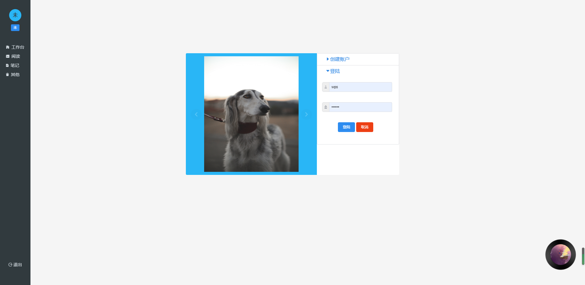

## 搬砖阅读（PDF）项目

​	我一后端开发，本着白嫖各种书籍的想法，瞎写着玩的，Base on  https://github.com/QianGuoqing/vue-evernote

搬砖的来。

**技术栈**

前端：

- Vue
- Vue-Router
- Vuex
- iView
- Stylus
- Axios
- Markdown-it
- vue-pdf

后端：（登陆注册及Auth验证模块）

- Express
- MongoDB


#### 效果展示

- 登录页




- 书籍页


- 阅读页


- 笔记页


- 其他


- 播放器

  

#### 使用

- 安装依赖

```
npm install
```

- 启动nodejs

```
cd src\server
node app.js
```

- 启动vue

```shell
npm run dev
```


#### 待优化

- pdf缩略图
- 首页展示信息，期望加入任务管理四象限
- vue-pdf展示不能放大，感觉字体有点小，有没有更好的展示方案
- 如何云存储
- 更多搬砖功能
